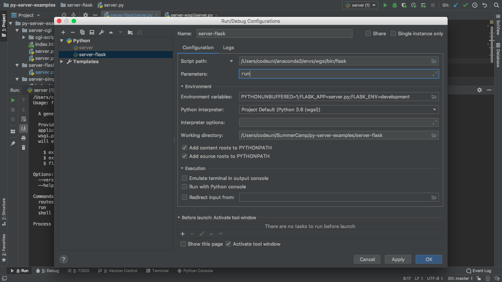
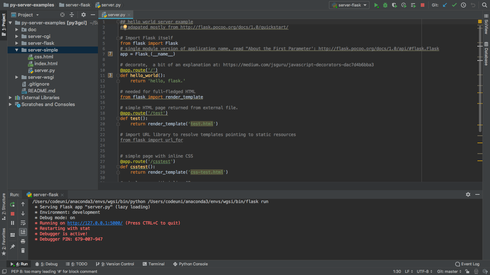
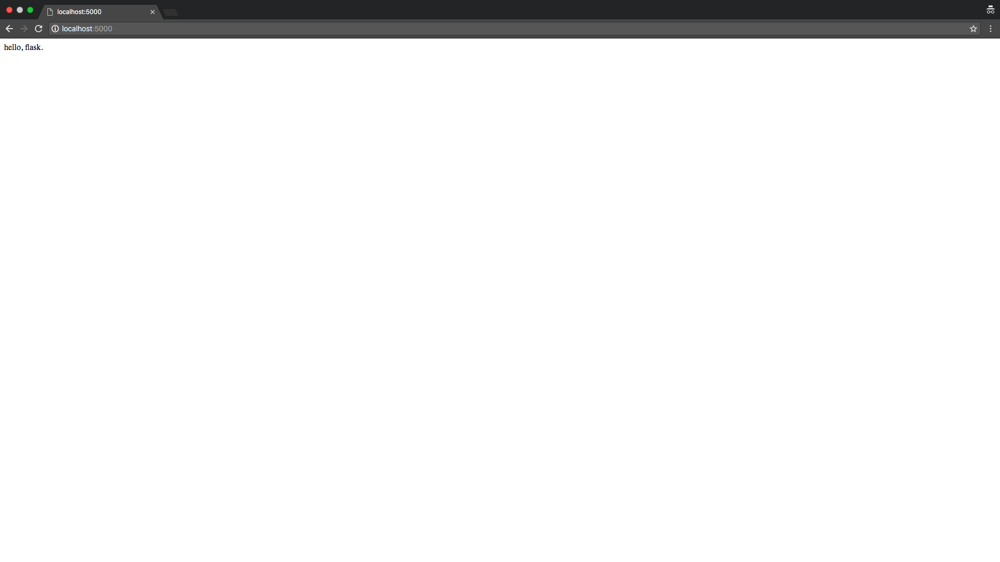

# py-server-examples
Simple python web server examples for demonstration and teaching.

# Installing server-flask 
This example with the Flask framework is a step towards a usable website setup. 
Flask does a lot of the "ugly" things behind the scenes, and sets you up to think about content. 
Behind the scenes, Flask is also using WSGI. The development server of flask is again state of the art, 
and it is not secure. It is _not_ to be used in any live website. This is for demonstration purposes only. 
The first few lines of `server-flask/server.py`, ending with the line `return 'hello, flask.'`, 
represents the entirety of a "hello world" with flask. Behind the scenes, it is running a server, and doing a lot of 
the work which has to be done by hand in the other server versions. 
In order to enable the framework, some setup is required, as described in the steps below.  

To run `server-flask`, first you will have to [install flask](http://flask.pocoo.org/docs/1.0/installation/#installation). 
Using Anaconda and PyCharm, the easiest way forward is to: 
* Choose a Python environment in Anaconda and install Flask
* In PyCharm, open Preferences/Settings --> Project --> Project Interpreter, and makes sure that the version of python which is installed 
in the environment which you chose in Anaconda is chosen.#
* To check that Flask is installed correctly and working, Open the Python Console in PyCharm. type `import flask`. If no errors occur, you are on the right path. 
* With the file `server-flask/server.py` open, select Run --> Edit Configurations. 
Follow the instructions listed under "Adding a Run and Debug Configuration" [on this site](https://blog.miguelgrinberg.com/post/setting-up-a-flask-application-in-pycharm).
In the end, your configuration file should like something like this:

* You should then be able to choose Run --> Run and choose "server-flask", or whatever you titled your configuration. 
You should see something like this:

And now, you should also be able to see the site in the browser: 

 
   
If this is what you see, you are all done! 
Open `server-flask/server.py` and look at various routes. 
Try to open the various pages in the browser.  
 

# Usage for the Simple, CGI and WSGI Server Examples 

For the other examples, the usage is simply to `cd` to the respective directory, and issue `python server.py`. 
This will serve at [http://localhost:8000/](http://localhost:8000/). Open that in your browser, and you will see something being served.  
To stop serving, simply type `Ctrl+c` in the terminal. The web server will keep running if you don't explicitly kill it.
To run one of the other implementations, kill the version you have open, `cd` into another directory, and run `python server.py`. 

Note that these examples are all written for python3.   

## Server Implementations  
The goal of this repo is to demonstrate various ways to set up a web server using Python, and to use some of the lower-level approaches to demonstrate what the server is doing. 

#### server-simple 
The simple-server is quite rudimentary. An HTML form is rendered, and a server will log the user's input. This example represents a static internet. 
Using this repo together with server-cgi, one can learn about GET and POST, and begin to understand what the client and server each do.
The server-simple implementation makes use of `http.server.SimpleHTTPRequestHandler`. 
   
#### server-cgi 
The simple-cgi is quite basic, making use of Common Gateway Interface (CGI). This was standard in the 1990's. Using CGI allows scripts to be run server-side. 
In this example, the input from an HTML form is parsed by a server-side python script, which returns an HTML response, which is then rendered in the browser. 
The server-simple implementation makes use of `http.server.CGIHTTPRequestHandler`. 
CGI is an outdated methodology for web servers, which today is problematic in many ways. It is included here solely for demonstrative purposes, and should not be used.   

#### server-wsgi
The server-wsgi implementation gets us towards the state of the art, making use of Web Server Gateway Interface (WSGI).
WSGI is a specification for an application and server to communicate with one another. The code is therefore more abstract than in the previous examples. 
This example uses the reference implementation of the WSGI specification which ships with Python, called `wsgiref`.
While one would generally _not_ use a "raw" implementation as is done here, modern python frameworks are built using this standard.
 

